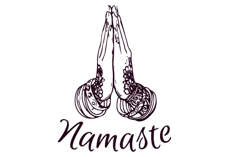

# the_war_of_kurukshetra

##The Kurukshetra War, also called the Mahabharata War, is a war described in the Hindu epic poem Mahābhārata. The conflict arose from a dynastic succession struggle between two groups of cousins, the Kauravas and Pandavas, for the throne of Hastinapura. It involved several ancient kingdoms participating as allies of the rival groups
